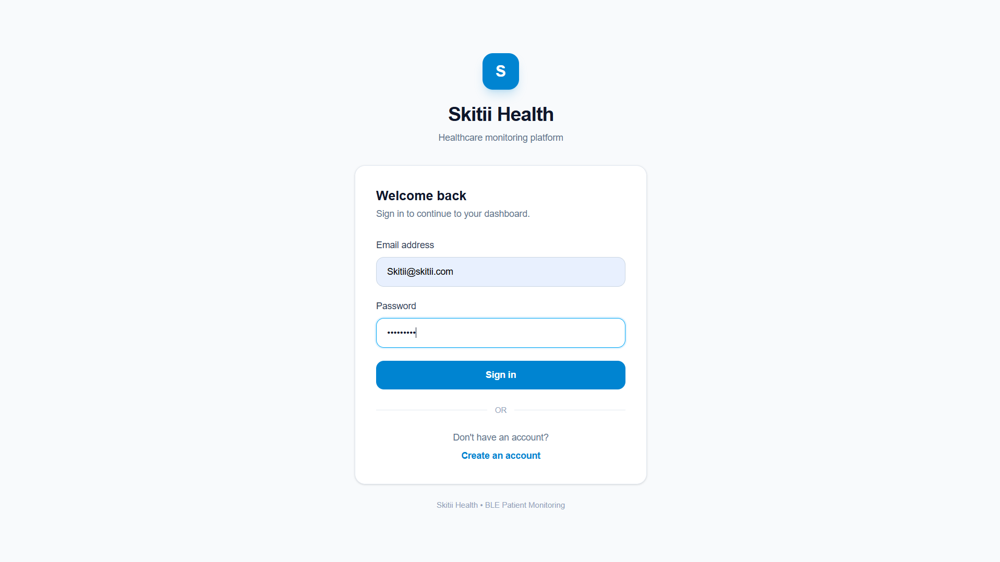
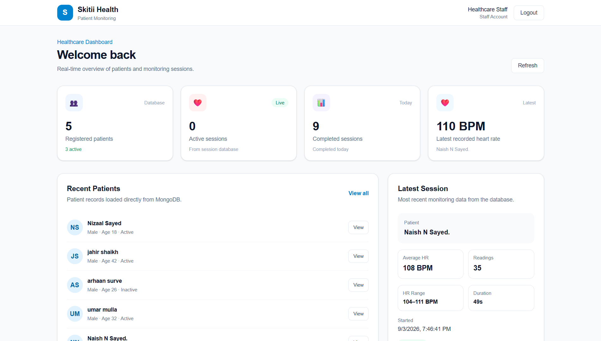
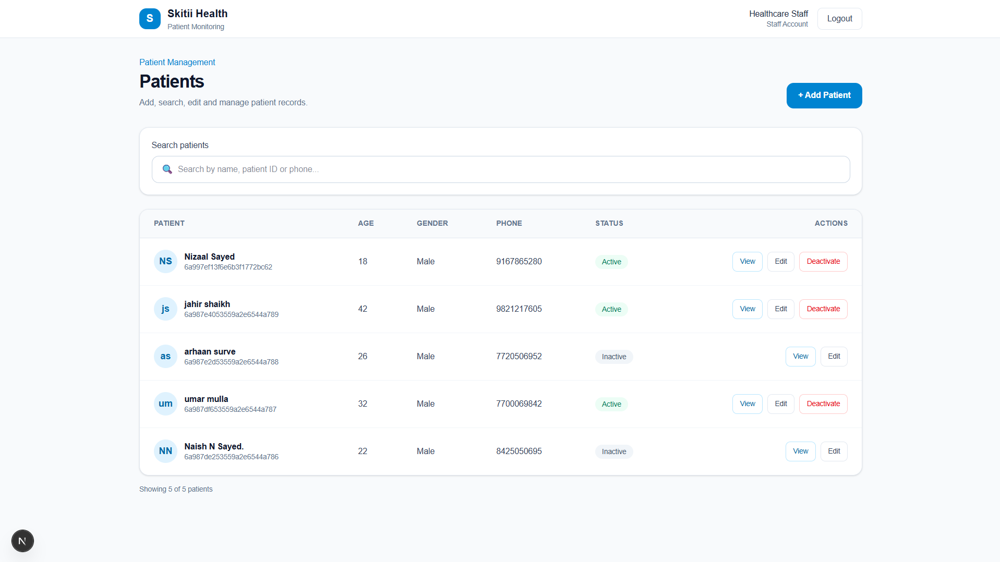
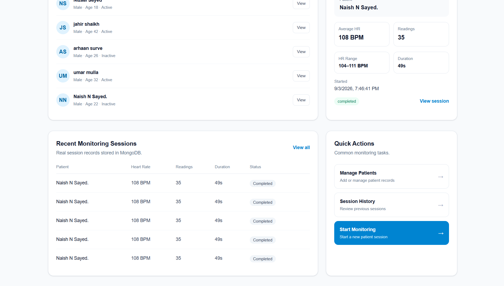
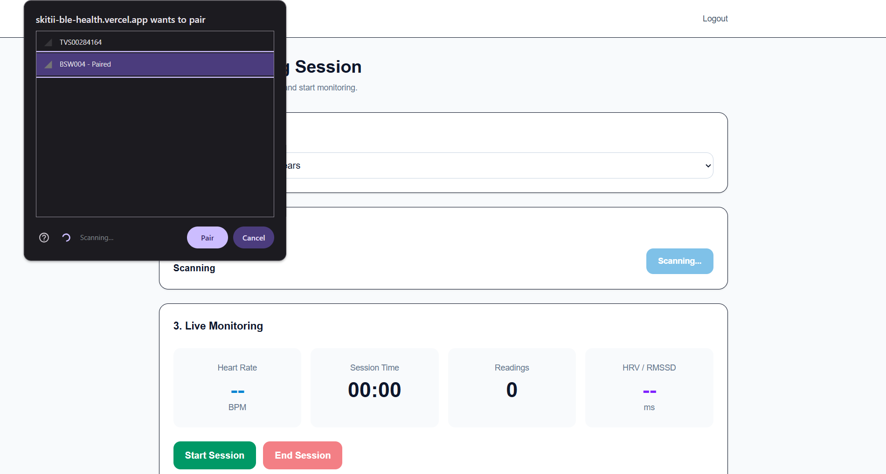
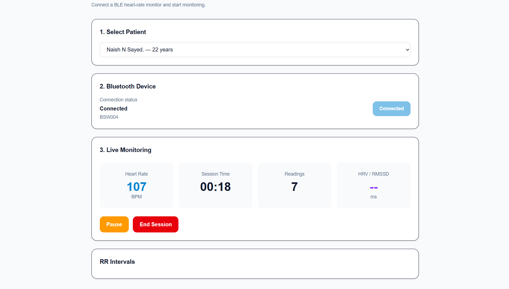
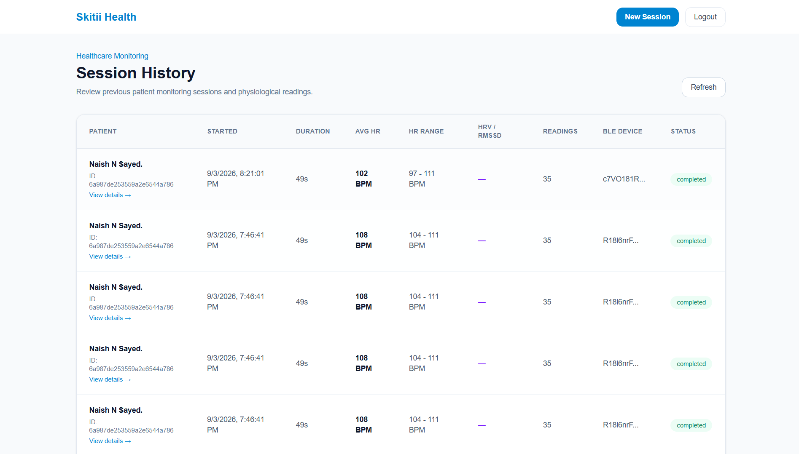
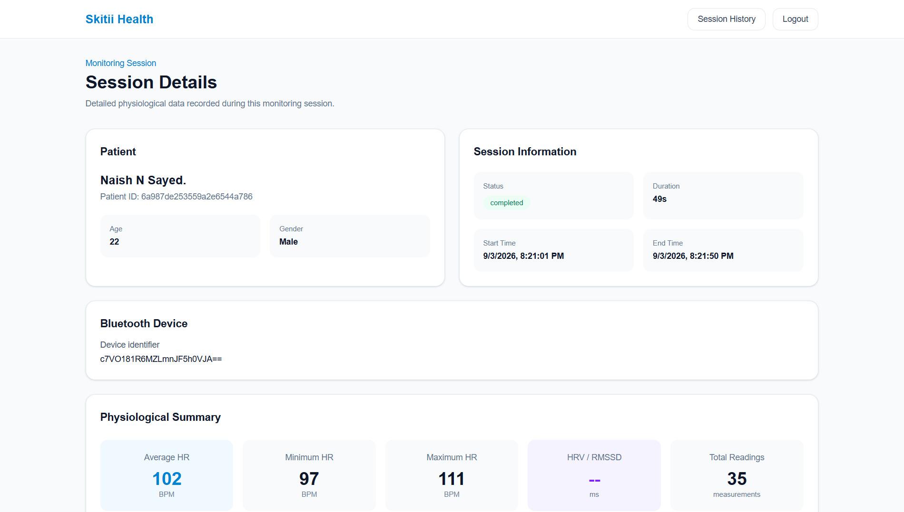
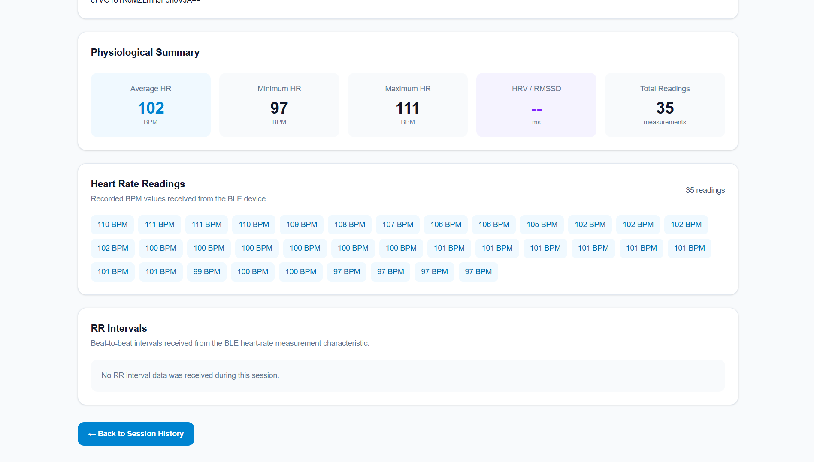
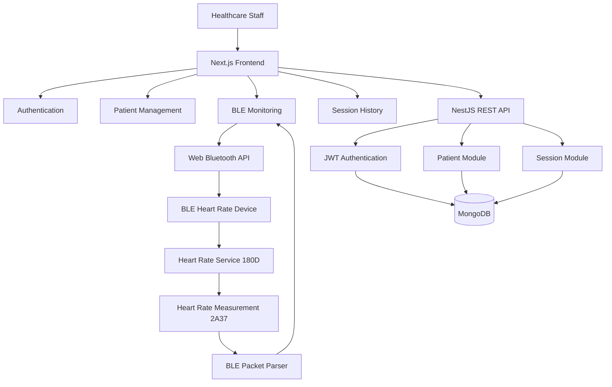

# 🏥 Skitii Health — BLE Patient Monitoring Platform

A full-stack healthcare monitoring application built for the **Skitii Health Tech Full-Stack Engineering Hiring Task — BLE Edition**.

The application allows healthcare staff to authenticate, manage patients, connect a real **Bluetooth Low Energy (BLE) heart-rate device**, monitor live physiological data, record monitoring sessions, and review session history.

> **Task scope:** This implementation targets **Task 1 — Patient Management + Live BLE Session App (Intern → Junior)**.

---

## 🎯 Task 1 Requirements Coverage

The project was built around the requirements in the Skitii hiring task:

| Requirement | Implementation |
|---|---|
| Staff authentication | JWT login, registration, logout, protected routes |
| Patient management | Add, view, search, edit, deactivate/delete |
| MongoDB persistence | MongoDB with Mongoose |
| BLE scanning | Browser Web Bluetooth API |
| Device selection | Browser BLE device picker |
| BLE connection | GATT connection |
| Service discovery | Primary service and characteristic discovery |
| Heart-rate notifications | BLE notification subscription |
| BLE packet parsing | Standard Heart Rate Measurement parser |
| Real BPM | BPM comes directly from the connected BLE device |
| RR intervals | Parsed when present in the BLE payload |
| HRV | RMSSD calculated when RR intervals are available |
| Connection states | Disconnected, Scanning, Connecting, Connected, Reconnecting, Error |
| Disconnect handling | Connection state is updated and received readings are preserved |
| Live session | Start, Pause/Resume, End, timer and live readings |
| Session history | Stored session metadata, readings and summary metrics |
| Backend APIs | NestJS REST APIs |
| Responsive UI | Next.js responsive interface |

The hiring task makes real BLE data mandatory and specifically requires scanning, device selection, connection, characteristic subscription, packet parsing, live UI updates, and disconnect handling.

---

## 📸 Screenshots

| Login | Dashboard | Patients |
|---|---|---|
|  |  |  |

| Dashboard (Alt View) | New Session — BLE Connect | New Session — Live Monitoring |
|---|---|---|
|  |  |  |

| Session History | Session Details | Session Details (Expanded) |
|---|---|---|
|  |  |  |

> All screenshots live in the `screenshots/` folder at the project root (sibling to this `README.md`). See the [Screenshots / Demo](#-screenshots--demo) section further down for the folder layout and file list.

---

## 🚀 Features

### 🔐 Authentication

- Staff registration and login
- JWT-based authentication
- Protected frontend routes
- Protected backend APIs
- Password hashing using bcrypt
- Logout
- Validation and useful authentication errors

### 👥 Patient Management

- Add patients
- View patient details
- Search patients
- Edit patient information
- Deactivate/delete patients
- Store patient records in MongoDB
- Select a patient before starting a monitoring session

### 🔵 Real BLE Heart-Rate Monitoring

- Scan for nearby BLE devices
- Select a BLE device through the browser
- Connect through GATT
- Discover BLE services and characteristics
- Discover the standard Heart Rate Service
- Subscribe to Heart Rate Measurement notifications
- Parse incoming BLE packets
- Display live BPM
- Parse RR intervals when available
- Track BLE connection state
- Handle BLE disconnection
- Preserve readings received before disconnection

### ❤️ Live Monitoring Sessions

- Select patient
- Connect BLE heart-rate device
- Start monitoring
- Pause/resume monitoring
- Live session timer
- Live BPM display
- RR interval display when available
- RMSSD/HRV calculation when RR data is available
- End and save session
- Store session summary metrics

### 📊 Session History

Each saved session can display:

- Patient
- Patient ID
- Start time
- End time
- Duration
- Average heart rate
- Minimum heart rate
- Maximum heart rate
- Total readings
- RR intervals when available
- RMSSD when available
- BLE device identifier
- Session status

### 📱 Android BLE Support

The application has been tested with **Chrome on Android** using the Fire-Boltt BSW004.

For this device, the browser can connect successfully when the watch is not already holding the BLE connection through the Da Fit application.

---

## 🛠️ Tech Stack

| Layer | Technology |
|---|---|
| Frontend | Next.js 16, React, TypeScript |
| Styling | Tailwind CSS |
| BLE | Browser Web Bluetooth API |
| Backend | NestJS 12 |
| Database | MongoDB Atlas / MongoDB |
| ODM | Mongoose |
| Authentication | JWT |
| Password Security | bcrypt |
| API | REST |
| Runtime | Node.js |

The hiring task specifies **Web Bluetooth API for Next.js** and requires real BLE values rather than generated/mock heart-rate readings.

---

## 🏗️ Architecture



### Runtime Data Flow

```text
BLE Heart Rate Device
        ↓
Web Bluetooth API
        ↓
BLE Service / Characteristic
        ↓
BLE Packet Parser
        ↓
Session State
        ↓
Live Vitals UI
        ↓
NestJS REST API
        ↓
MongoDB
```

This follows the data flow described in the hiring task: BLE device → service/characteristic → parser → session state/data layer → live vitals UI → session storage/API.

---

## 🔵 BLE Implementation

The application uses the standard Bluetooth Heart Rate profile:

```text
Heart Rate Service
0000180d-0000-1000-8000-00805f9b34fb

Heart Rate Measurement
00002a37-0000-1000-8000-00805f9b34fb
```

### BLE Workflow

```text
Scan
  ↓
Select Device
  ↓
Connect
  ↓
Discover Services
  ↓
Find Heart Rate Measurement
  ↓
Subscribe to Notifications
  ↓
Receive BLE Packet
  ↓
Parse BPM
  ↓
Parse RR Intervals if Present
  ↓
Update Live Session
  ↓
Save Session
```

The application does **not** generate random BPM values. Heart-rate readings shown by the monitoring UI are received from the connected BLE device.

### BLE Packet Parsing

The Heart Rate Measurement parser handles:

- Heart-rate measurement flags
- 8-bit heart-rate values
- 16-bit heart-rate values when indicated by the packet
- RR intervals when present
- Conversion of RR interval values to milliseconds
- Timestamping of received readings
- RMSSD calculation from available RR interval data

---

## 🔌 BLE Connection States

The application represents the BLE connection using clear states:

```text
Disconnected
     ↓
Scanning
     ↓
Connecting
     ↓
Connected
     ↓
Reconnecting
     ↓
Connected
     ↓
Disconnected / Error
```

If the BLE device disconnects during monitoring:

1. The connection state is updated.
2. The existing readings remain in the active session data.
3. The application does not silently discard the readings already received.
4. The session can be ended and saved with the data collected before the disconnect.

The hiring task explicitly requires disconnect handling and preservation of previously received session data.

---

## ⌚ Tested BLE Device — Fire-Boltt BSW004

The implementation has been tested with:

**Fire-Boltt BSW004**

The device exposed:

```text
Heart Rate Service
        ↓
180D
        ↓
Heart Rate Measurement
        ↓
2A37
        ↓
Notifications
        ↓
Real BPM Readings
```

### Important BSW004 Behavior

The BSW004 requires the heart-rate measurement to be **started manually from the watch** before continuous heart-rate notifications are transmitted.

Also, when testing through Android Chrome, the watch should not be actively connected to the **Da Fit** application at the same time.

If Da Fit is holding the BLE connection, Chrome may not be able to establish its own GATT connection.

### Recommended Android Test Setup

1. Enable Bluetooth on the Android phone.
2. Open the website in **Google Chrome**.
3. Disconnect/unbind the BSW004 from Da Fit.
4. Open the Heart Rate screen on the watch.
5. Start heart-rate measurement on the watch.
6. Open **New Monitoring Session**.
7. Select **Scan & Connect**.
8. Select the BSW004.
9. Start the monitoring session.
10. Confirm that live BPM readings are received.

---

## ❤️ Live Session Example

During a live monitoring session, the interface provides information such as:

```text
Heart Rate: 84 BPM
Session Time: 01:33
Readings: 35
Connection: Connected
```

The session can be:

```text
Start → Pause → Resume → End
```

The saved session contains the readings and calculated summary values available from the device.

---

## 🧮 Heart Rate and HRV

### Heart Rate

BPM is obtained directly from the BLE Heart Rate Measurement characteristic.

### RR Intervals

If RR interval information is included in the received Heart Rate Measurement packet, the application parses and stores those values.

### RMSSD

When enough RR interval data is available, the application calculates RMSSD as an HRV-related metric.

If the BLE device does not provide RR intervals, RMSSD is shown as unavailable rather than being generated or estimated.

---

## 👥 Patient Management Flow

```text
Staff Login
    ↓
Patient Management
    ↓
Add / Search / View / Edit / Deactivate
    ↓
Select Patient
    ↓
New Monitoring Session
    ↓
Connect BLE Device
    ↓
Record Session
```

Patient records are persisted in MongoDB.

---

## 📊 Session Storage

A monitoring session stores information including:

```text
patientId
startTime
endTime
duration
deviceId
status
heartRateReadings[]
rrIntervals[]
averageHeartRate
minHeartRate
maxHeartRate
rmssd
```

The session API is responsible for persisting completed monitoring sessions in MongoDB.

---

## 🌐 Backend API

### Authentication

| Method | Endpoint | Purpose |
|---|---|---|
| `POST` | `/auth/login` | Authenticate staff and return JWT |

### Patients

| Method | Endpoint | Purpose |
|---|---|---|
| `GET` | `/patients` | Get patients |
| `POST` | `/patients` | Create patient |
| `GET` | `/patients/:id` | Get patient |
| `PATCH` | `/patients/:id` | Update patient |
| `DELETE` | `/patients/:id` | Deactivate/delete patient |

### Sessions

| Method | Endpoint | Purpose |
|---|---|---|
| `POST` | `/sessions` | Create/save monitoring session |
| `GET` | `/sessions` | Get session history |
| `GET` | `/sessions/:id` | Get session details |

Protected endpoints require:

```text
Authorization: Bearer <JWT>
```

These endpoints cover the Task 1 backend API requirements specified in the hiring task.

---

## 🔐 Security

- Passwords are hashed with bcrypt.
- JWT access tokens protect authenticated API resources.
- Protected backend routes require a valid Bearer token.
- Protected frontend screens require authentication.
- MongoDB credentials are stored in environment variables.
- JWT secrets are stored in environment variables.
- `.env` and `.env.local` files are excluded from Git.

---

## ⚙️ Project Structure

```text
skitii-ble-health/
│
├── frontend/
│   ├── src/
│   │   └── app/
│   │       ├── dashboard/
│   │       ├── patients/
│   │       ├── sessions/
│   │       ├── signup/
│   │       └── page.tsx
│   ├── package.json
│   └── .env.local
│
├── backend/
│   ├── src/
│   │   ├── auth/
│   │   ├── patients/
│   │   ├── sessions/
│   │   ├── app.module.ts
│   │   └── main.ts
│   ├── package.json
│   └── .env
│
├── screenshots/
│   ├── Login.png
│   ├── Dashboard_1.png
│   ├── Dashboard_2.png
│   ├── patients.png
│   ├── session1.png
│   ├── session2.png
│   ├── session_history.png
│   ├── session_details.png
│   └── session_details2.png
│
├── README.md
├── vercel.json
└── .gitignore
```

---

## 📦 Installation

### 1. Clone the Repository

```bash
git clone https://github.com/naishsayed/skitii-ble-health.git
cd skitii-ble-health
```

### 2. Install Frontend Dependencies

```bash
cd frontend
npm install
```

### 3. Install Backend Dependencies

Open another terminal:

```bash
cd backend
npm install
```

---

## 🔑 Environment Variables

### Frontend

Create:

```text
frontend/.env.local
```

For local development:

```env
NEXT_PUBLIC_API_URL=http://localhost:3001
```

### Backend

Create:

```text
backend/.env
```

Example:

```env
MONGODB_URI=mongodb://127.0.0.1:27017/skitii_health
PORT=3001
JWT_SECRET=your-secret-key
```

For MongoDB Atlas, replace `MONGODB_URI` with the Atlas connection string.

> Never commit real secrets. The repository excludes environment files through `.gitignore`.

The hiring task also requires an `.env.example` containing no real secrets.

---

## ▶️ Local Development

### Start the Backend

```bash
cd backend
npm run start:dev
```

Local backend:

```text
http://localhost:3001
```

### Start the Frontend

In another terminal:

```bash
cd frontend
npm run dev
```

Local frontend:

```text
http://localhost:3000
```

Open the application in a browser that supports Web Bluetooth.

---

## 📱 Browser and BLE Requirements

For Web Bluetooth testing:

- Use a supported browser.
- Use **Google Chrome on Android** for Android BLE testing.
- Bluetooth must be enabled.
- The website must run in a secure context such as HTTPS in production.
- The BLE device must expose a compatible GATT service/characteristic.
- The BLE device should not be held by another application at the same time.

Web Bluetooth support depends on the browser and device implementation.

---

## 🧭 Application Routes

| Route | Purpose |
|---|---|
| `/` | Staff Login |
| `/signup` | Staff Registration |
| `/dashboard` | Monitoring Dashboard |
| `/patients` | Patient Management |
| `/sessions/new` | New BLE Monitoring Session |
| `/sessions` | Session History |
| `/sessions/[id]` | Session Details |

---

## 🧪 Testing and Verification

The following Task 1 workflows have been manually tested:

### Authentication

- ✅ Staff registration
- ✅ Login
- ✅ JWT authentication
- ✅ Protected routes
- ✅ Logout
- ✅ Authentication errors

### Patient Management

- ✅ Patient creation
- ✅ Patient viewing
- ✅ Patient search
- ✅ Patient editing
- ✅ Patient deactivation/delete

### BLE

- ✅ BLE device scanning
- ✅ Device selection
- ✅ BLE connection
- ✅ GATT service discovery
- ✅ Heart Rate Service discovery
- ✅ Heart Rate Measurement characteristic discovery
- ✅ Notification subscription
- ✅ Real BPM readings
- ✅ RR interval parsing when available
- ✅ Timestamped readings
- ✅ BLE disconnect handling
- ✅ Previously received readings preserved

### Sessions

- ✅ Start session
- ✅ Pause/resume session
- ✅ Session timer
- ✅ End session
- ✅ Session persistence
- ✅ Session history
- ✅ Session details
- ✅ Summary metrics

### Build

- ✅ Frontend production build
- ✅ Backend production build

---

## 🏁 BLE Acceptance Checklist

The hiring task provides an explicit BLE acceptance checklist.

| Acceptance Item | Status |
|---|---|
| App can scan for a BLE device | ✅ |
| Operator can select a device | ✅ |
| App connects successfully | ✅ |
| Correct service/characteristic discovered | ✅ |
| Notifications subscribed to | ✅ |
| Heart Rate Measurement packets parsed | ✅ |
| BPM comes from BLE | ✅ |
| RR intervals parsed when available | ✅ |
| Readings include timestamps | ✅ |
| BLE disconnect handled | ✅ |
| Existing readings survive disconnect | ✅ |
| Session can finish without internet | ⚠️ Not implemented as an offline-first feature |
| Session data can sync later | ⚠️ Not implemented |
| Retry cannot create duplicate sessions | ⚠️ Not implemented |

The last three items belong to the broader offline-first/synchronization expectations described in the hiring document. This repository currently focuses on **Task 1**, rather than implementing the full Task 2 offline synchronization architecture.

---

## 💾 Local Storage, Sync and Failure Handling

### Current Task 1 Approach

The live session keeps received BLE readings in the active application session state. When the session ends, the collected session data is sent to the NestJS backend and persisted in MongoDB.

### BLE Failure Handling

If the BLE device disconnects:

- The connection state is updated.
- Previously received readings remain available.
- The application does not silently discard collected measurements.
- The operator can finish the session using the readings already received.

### Offline Synchronization

A durable offline queue, background synchronization, idempotency keys, and app-restart recovery are **not implemented in the current Task 1 version**.

Those capabilities are part of the more advanced **Task 2 — Offline-First BLE Therapy Session App**, which requires local persistence, sync states, duplicate protection, and recovery behavior.

---

## ⚠️ Known Limitations

### BSW004 Measurement Activation

The tested Fire-Boltt BSW004 requires heart-rate measurement to be started manually from the watch before it continuously transmits heart-rate notifications.

### Da Fit Connection

The BSW004 should not be actively connected to Da Fit while the browser is attempting to connect through Web Bluetooth.

### BLE Device Compatibility

Different BLE heart-rate devices can expose different GATT services and packet formats. The current implementation focuses on the standard Bluetooth Heart Rate Service and Heart Rate Measurement characteristic.

### RR Interval Availability

RR interval data depends on the connected BLE device. If RR intervals are not included in the device payload, RMSSD cannot be calculated.

### Web Bluetooth Browser Support

BLE functionality depends on browser support for Web Bluetooth. Android Chrome is the tested mobile browser for this project.

---

## 📸 Screenshots / Demo

The hiring task requests screenshots or a short demo video as part of the candidate deliverables.

Screenshots are stored at the project root, in a `screenshots/` folder next to this `README.md`:

```text
screenshots/
├── Login.png
├── Dashboard_1.png
├── Dashboard_2.png
├── patients.png
├── session1.png
├── session2.png
├── session_history.png
├── session_details.png
└── session_details2.png
```

They are embedded above in the [Screenshots](#-screenshots) section near the top of this document.


---

## 🏗️ Production Deployment

The intended deployment architecture is:

```text
Vercel
└── Next.js Frontend

Render
└── NestJS Backend

MongoDB Atlas
└── Production Database
```

Production environment variables should be configured through the hosting platforms and should never be committed to the repository.

---

## 📈 Build Verification

### Frontend

```bash
cd frontend
npm run build
```

### Backend

```bash
cd backend
npm run build
```

Both frontend and backend production builds have been verified successfully during development.

---

## 🎓 Evaluation Alignment

The hiring task evaluates Task 1 using:

| Area | Weight |
|---|---:|
| UI / React / RN | 15% |
| BLE scanning + connection | 20% |
| BLE characteristic subscription + parsing | 15% |
| Node / NestJS | 15% |
| MongoDB | 10% |
| API / Authentication | 10% |
| Disconnect/error handling | 10% |
| Code quality | 5% |

This project focuses on the highest-value Task 1 areas: real BLE connectivity, correct heart-rate parsing, live monitoring, backend integration, MongoDB persistence, authentication, and connection failure handling.

---

## 🔮 Future Improvements

The following features can be added in future iterations:

- Automatic BLE reconnection
- Broader BLE device compatibility
- Durable offline session storage
- Offline synchronization queue
- Idempotent session synchronization
- App restart/recovery support
- Pagination for large patient/session datasets
- Automated unit and integration tests
- Swagger/OpenAPI documentation
- Docker deployment
- Additional BLE device protocol support

---

## 🤝 Contributing

Contributions and suggestions are welcome.

1. Fork the repository.
2. Create a feature branch.
3. Make your changes.
4. Test the application.
5. Submit a pull request.

---

## 📄 License

This project was developed as part of the **Skitii Health Tech Full-Stack Engineering Hiring Task — BLE Edition**.

---

## 👨‍💻 Project

### Skitii Health — BLE Patient Monitoring Platform

Built with:

**Next.js • React • TypeScript • NestJS • MongoDB • JWT • Web Bluetooth API**

GitHub:

https://github.com/naishsayed/skitii-ble-health
